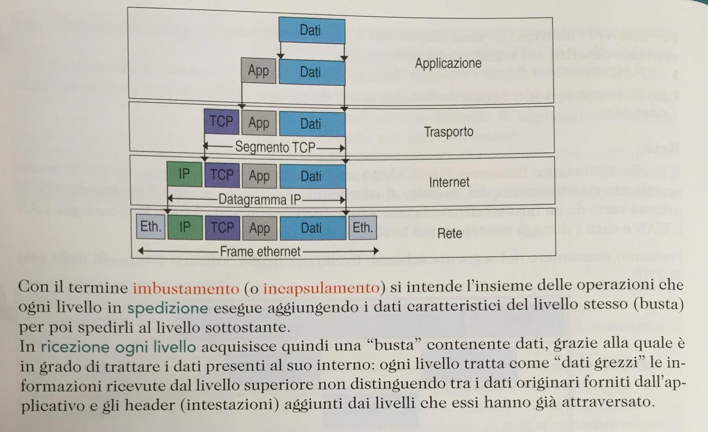

# Ripasso - Il mio host

* Pubblicato su: https://github.com/feroda/lessons-itis/ -> branch 4ais
* Riferimento diretto: https://github.com/feroda/lessons-itis/blob/4ais/doc/ripasso-il-mio-host.md

Questo ripasso fa riferimento alla
[sezione "Il mio host" nel programma](https://github.com/feroda/lessons-itis/blob/4ais/doc/programma.md)

## Dall'indirizzo IPv4 all'appartenenza di un IP ad una stessa rete

### Indirizzo IP (versione 4)

**Un indirizzo IPv4** (IP versione 4) è una stringa composta di 4 bytes nella forma A.B.C.D, ad esempio 172.16.23.50. I singoli numeri vengono chiamati "ottetti" proprio perché ogni byte è composto di 8 bit. In totale quindi un indirizzo IP è composto di 32 bit.

Normalmente quando parliamo di **indirizzo IP** intendiamo l'identificativo di un host in una rete.

Un host è un nodo della rete IP, sia esso un PC, un telefonino, un router, una scheda.

### Maschera di rete ed indirizzo IP di rete

Per capire se 2 IP appartengono alla stessa rete ho bisogno di trovare l'**indirizzo IP di rete** che posso trovare solo con la **maschera di rete** (subnet mask), che può essere espressa in forma estesa nella forma di un indirizzo IP (A.B.C.D).

Le maschere di rete più comuni sono della forma:

- a. 255.0.0.0
- b. 255.255.0.0
- c. 255.255.255.0

Per ottenere quindi l'indirizzo IP di rete è necessario mettere in **AND bit a bit un indirizzo IP con una maschera di rete**.

Ad esempio: qual è l'indirizzo IP di rete dell'IP 172.16.23.50 con maschera di rete 255.255.0.0?

* 172 & 255 = 172
* 16 & 255 = 16
* 23 & 0 = 0
* 50 & 0 = 0

Le regole di comodo sono 2:

* X & 255 = X
* Y & 0 = 0

Questo perché ogni componente è composta di 8 bit e se noi rappresentiamo ogni bit otteniamo:

* 172 & 255 = 10101100 & 11111111 = 10101100 = 172
* 16 & 0 = 00010000 & 11111111 = 00010000 = 16
* 23 & 0 = 00010111 & 00000000 = 00000000 = 0
* 50 & 0 = 00110010 & 00000000 = 00000000 = 0

poiché ogni bit messo in AND con 1 restituisce 0 e ogni bit messo in AND con 0 restituisce 0.

Quindi possiamo dire che l'host che ha:

* indirizzo IP = 172.16.23.50
* maschera di rete = 255.255.0.0

appartiene alla rete 172.16.0.0, o se vogliamo, alla rete il cui indirizzo ip di rete è 172.16.0.0

### Come verifico se 2 ip appartengono alla stessa rete?

Innanzi tutto ho bisogno di:

* 2 indirizzi IP (IP H1-IP, IP H2-IP) e
* 2 maschere di rete (H1-NETMASK, H2-NETMASK).

Poi eseguo l'operazione di AND bit a bit (nel caso di marchere semplici tipo quelle viste sopra non occorre che trasformo gli ottetti in sequenze di bit) e
vedo se gli indirizzi IP di rete sono uguali.

Ossia se H1-NETWORK = H2-NETWORK dove:

* H1-NETWORK = H1-IP & H1-NETMASK
* H2-NETWORK = H2-IP & H2-NETMASK

**Se questo accade H1 e H2 sono sulla stessa rete**

Esempio:

- H1. 172.16.23.50 & 255.255.0.0 = 172.16.0.0
- H2. 172.16.3.12 & 255.255.255.0 = 172.16.3.0
- H3. 172.16.250.30 & 255.255.0.0 = 172.16.0.0
- H4. 10.18.34.34 & 255.255.0.0 = 10.18.0.0

**H1 è sulla stessa rete di H3** quindi possono comunicare direttamente.
Gli altri non comunicano con nessun altro.

## Configurazione di un host in una rete LAN

La configurazione di un host in una stessa rete fisica può essere fatta impostando esclusivamente:

1. indirizzo IP
2. maschera di rete

Se ho l'esigenza di configurare un host H1 nella stessa rete dove c'è già un host preesistente H2, prima di tutto ho bisogno di individuare la rete e quindi sapere:

* l'indirizzo IP di rete e la
* maschera di rete

che è equivalente a dire che devo sapere:

* l'indirizzo IP dell'host H2
* la maschera di rete dell'host H2

Esempio da:

- Indirizzo IP di H2: 34.4.5.254
- Maschera di rete di H2: 255.255.0.0

ne consegue:

- Indirizzo IP della rete: 34.4.0.0

per mettere un host su questa rete posso prendere un indirizzo IP a scelta tra:

**34.4.0.1 e 34.4.255.254**
poiché la rete va da 34.4.0.0 a 34.4.255.255

Visto che il 34.4.5.254 è già occupato da H2 NON scelgo quello.

(NOTA: se ho problemi con il mio nuovo IP provo con un altro indirizzo IP perche' potrebbe averlo preso qualcun altro)

Evito quindi di usare come IP:
- L'IP che già conosco su questa rete
- **L'indirizzo di broadcast**: 34.4.255.255
- **L'indirizzo ip di rete**: 34.4.0.0

NOTA sull'indirizzo di broadcast (non necessario per la verifica del 29 novembre):
se l'indirizzo di rete viene individuato mettendo in AND l'indirizzo IP e la maschera di rete,
**l'indirizzo di broadcast viene individuato mettendo in OR la NEGAZIONE della maschera di rete**.

### visualizzazione della configurazione di rete

Domanda: come posso visualizzare se in un dato momento il mio host ha la configurazione di rete che io mi aspetto?
Risposta: ogni sistema operativo offre la possibilità di visualizzare la configurazione della rete. Nelle "informazioni sulla connessione". Questa si può raggiungere da interfaccia grafica sia su Ubuntu che su Windows, e da terminale.

Da terminale su Ubuntu ci sono i comandi

* `ifconfig`
* `ip addr list`

per mostrare la configurazione di rete

Da terminale su Windows c'è il comando

* `ipconfig`

di solito invocato con il parametro `/all`

* `ipconfig /all`

### test della configurazione di rete locale

Il test della configurazione corretta della rete locale lo posso fare con

`ping H2` ossia il ping **ad un indirizzo della mia stessa rete**

## Uscire dalla rete con il default gateway

Ora che ho connesso il mio host nella rete voglio che raggiunga altre reti e in particolare Internet.

Per fare questo imposto il parametro **default gateway**.

Il default gateway identifica la macchina a cui il mio host invia i pacchetti se non sa a chi inviarli (possiamo dire anche "se su reti che il mio host non conosce" o "se su reti non presenti nella tabella di routing del mio host")

Il test che il gateway funziona lo faccio con `ping` ad un indirizzo esterno (ad es: 89.97.132.192)

L'host identificato da me come gateway non è altro che un router.
Un router per definizione è collegato a più di una rete e il suo ruolo è quello di instradare i pacchetti tra le reti cui è connesso.

#### Domande

- quale livello dello stack TCP/IP sto testando?
- se mi funziona la connessione in LAN, ma non funziona il ping all'indirizzo IP scelto, quali altri test posso fare per chiarire meglio la situazione? Fino a che punto posso attribuirmi la colpa, oppure rinunciare al
fatto che la connessione funzioni se non sento l'amministratore di rete?

## Ruolo del DNS

Il servizio DNS funziona in modo analogo ad una rubrica telefonica.

I servizi DNS pubblici sono come la rubrica degli indirizzi IP di Internet, come le pagine bianche però mondiali.

Il servizio DNS viene contattato ogni volta che un programma vuole raggiungere un altro host tramite il nome host, e non direttamente tramite l'indirizzo IP.

TEST:
* si può fare con `ping`. Ad esempio: `ping www.google.it`
* strumento specifico per testare il servizio dns è `dig` (ad es: `dig www.google.it` o `dig +short www.google.it`)

Come verifico se ho interrogato il DNS?
Con un analizzatore di traffico di rete... quale sarà mai?

## incapsulamento dei pacchetti sulla rete - caratteristiche di ogni livello del TCP/IP

Posso avviare l'analizzatore di rete wireshark con `sudo wireshark`, selezionare una interfaccia di rete con cui catturare i pacchetti e poi avviare l'acquisizione.

Il programma è diviso in 3 riquadri.

* Nel primo in alto vedo la lista dei pacchetti acquisiti
* Se seleziono un pacchetto a caso, vedo in fondo (terzo riquadro) i byte che lo compongono
* Se clicco nella parte centrale del programma **si evidenziano** nella parte sottostante (ossia sempre il terzo riquadro) i byte coinvolti.

Quindi posso cliccare su ogni livello dello stack TCP/IP (riquadro centrale) e verificare come avviene l'incapsulamento (o imbustamento) di un pacchetto.

Attenzione che wireshark aggiunge uno "pseudo-livello" chiamato "Frame". Questa astrazione è fatta solamente per dare informazioni sul pacchetto acquisito (ad esempio: quando wireshark ha acquisito quel pacchetto)

Per il supporto di teoria vedere lo schema: 

* Utente -> usa il software X che gli serve per ottenere una funzionalità.
* X parla ad un livello APPLICAZIONE
* Il SO con lo stack TCP/IP aggiunge:
  * una intestazione di TRASPORTO (intestazione TCP o UDP)
  * una intestazione di RETE (intestazione IP)
  * una intestazione di livello DATALINK (intestazione Ethernet) e si costituisce cosi il FRAME ETHERNET

Il messaggio viaggia sulla rete

* Il SO sull'altro host riceve il messaggio e toglie:
  * l'intestazione Ethernet
  * l'intestazione IP
  * l'intestazione TCP (o UDP)
* Il SO manda il contenuto di livello APPLICAZIONE al software Y (remoto) che:
  * interpreta il MESSAGGIO
  * elabora la risposta
  * risponde

La risposta verrà presa in carico dal SO e attraverserà lo stack TCP/IP

